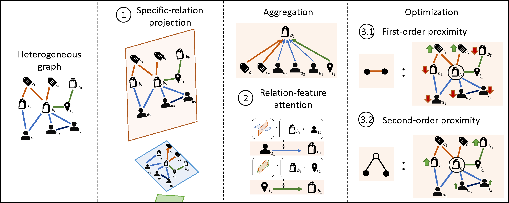

# PGRA
The code for the paper "[PGRA: Projected Graph Relation-Feature Attention Network for Heterogeneous Information Network Embedding](https://doi.org/10.1016/j.ins.2021.04.070)", Information Sciences.



## Requirements

We tested the code on:
* python 3.6
* pytorch 1.5.1
* networkx 2.3

other requirements:
* numpy
* pandas

## Usage

Run the code using the command:
```
python src/main.py [Dataset_Name] [options]
```
We provide datasets in "data.zip" file.

## Options
For PGRA-DistMult, use default hyperparameters

For PGRA-TransH, use
```
--score [l1/l2] --pre transh
```

For the best neighbor regularization settings (lambda) on DBLP/Yelp/DM/Aminer, use
```
--best_lambda
```
or to manually set, use
```
--nb_reg [value]
```

## Reference

If you find our work helpful, please cite our work
```
@article{chairatanakul2021pgra,
  title = {PGRA: Projected graph relation-feature attention network for heterogeneous information network embedding},
  journal = {Information Sciences},
  volume = {570},
  pages = {769-794},
  year = {2021},
  issn = {0020-0255},
  doi = {https://doi.org/10.1016/j.ins.2021.04.070},
  url = {https://www.sciencedirect.com/science/article/pii/S0020025521004059},
  author = {Nuttapong Chairatanakul and Xin Liu and Tsuyoshi Murata}
}
```
